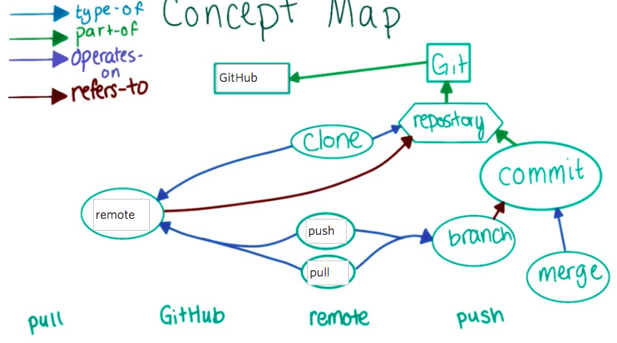
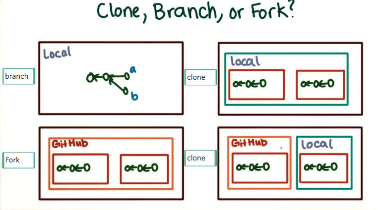

# Lesson 3

### creating repository on github

- create repository on github (+) sign
- add repo as a remote to the repo on your computer
- git remote # see all the current remotes
- add repo: git remote add <name> # meestal origin:
	`git remote add origin https://github.com/thebuunkenator/reflections.git`

`> git remote -v`

`origin	 https://github.com/thebuunkenator/reflections.git (fetch)`

`origin	 https://github.com/thebuunkenator/reflections.git (push)`

`> git push origin master # arg1: remote you want to push changes to, #arg2 local branch you like to push`

### When would you want to use a remote repository rather than keeping all your work local?
- when you are not on your own computer
- when you don't need to do something with your files (compile f.e.)
- when other people need to see changes immediately

When you made changes remote (or someone else has made changes) you need to update your local repository:

`git pull origin master` 

### Why might you want to always pull changes manually rather than having Git automatically stay up-to-date with your remote repository?

- you never know what has been changed, and don't know if you're code is still working. You first need to check this
- changes are difficult to be undone
- You might need to merge branches
- Maybe you work on another branch

# Forking

- Is like cloning on only server (no local involved)
- link back to original repository

steps:

- Fork the repository to your own account
- clone it to your own computer (directory will be created)
- 

`git clone https://github.com/thebuunkenator/recipes.git`

remote is automatically created
- git remote -v

# collaborators

Add collaborators: 
`Settings>Collaborators`

### Describe the differences between forks, clones, and branches. When would you use one instead of another?
A fork is a clone only on the server
A clone kan be local or can be made remote to local
A branch can exist only remote (?), only local or both. 

you make forks when you want a copy that is seperate from the others, or you do not have permission to edit/collaborate on the project as a whole. A branch you use when you want to make edit on the source, but may want to merge later.

 

